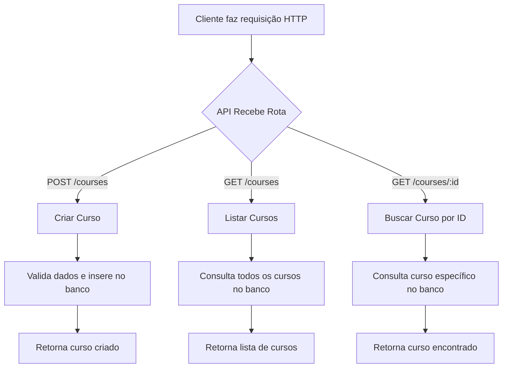

# Desafio Node.js

This is a Node.js application designed as a challenge project. It uses TypeScript, Drizzle ORM, and Docker for development and database management.

## Features
- RESTful API for managing courses
- Database migrations with Drizzle
- Organized project structure with routes and database modules
- Docker support for easy setup

## Project Structure
```
docker-compose.yml         # Docker configuration for services
drizzle.config.ts          # Drizzle ORM configuration
package.json               # Project dependencies and scripts
server.ts                  # Main server entry point
tsconfig.json              # TypeScript configuration
src/
  database/
    client.ts              # Database client setup
    schema.ts              # Database schema definitions
  routes/
    create-course.ts       # Route to create a course
    get-course-by-id.ts    # Route to get a course by ID
    get-courses.ts         # Route to list all courses
drizzle/
  *.sql                    # Database migration files
  meta/                    # Drizzle migration metadata
```

## Getting Started

### Prerequisites
- Node.js (v18+ recommended)
- Docker & Docker Compose

### Installation
1. Clone the repository:
   ```sh
   git clone https://github.com/HigorCampelo/ProjetoNodejs.git
   cd ProjetoNodejs
   ```
2. Install dependencies:
   ```sh
   npm install
   ```
3. Copy and configure environment variables if needed.

### Running with Docker
Start the database and any other services:
```sh
docker-compose up -d
```

### Running the App
Start the server:
```sh
npm run dev
```

### Database Migrations
Run Drizzle migrations:
```sh
npm run drizzle:migrate
```

## API Endpoints
- `POST /courses` - Create a new course
- `GET /courses` - List all courses
- `GET /courses/:id` - Get course by ID

## License
MIT


## Fluxo Principal da Aplicação


